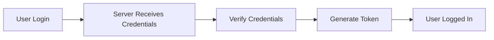
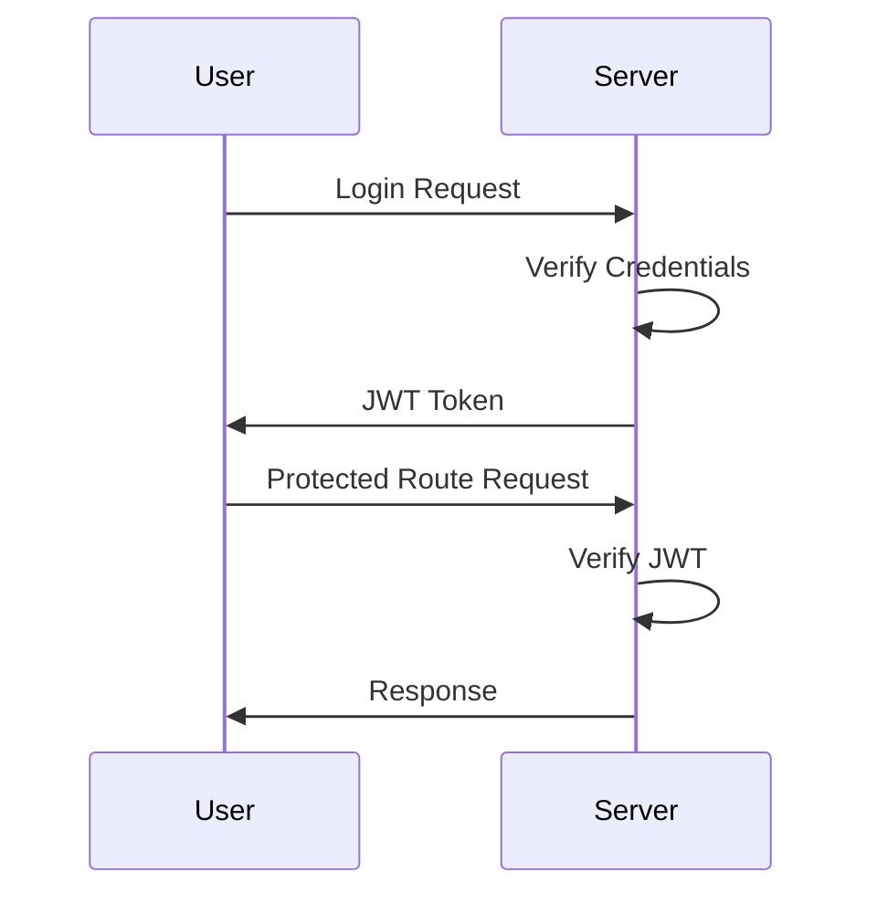
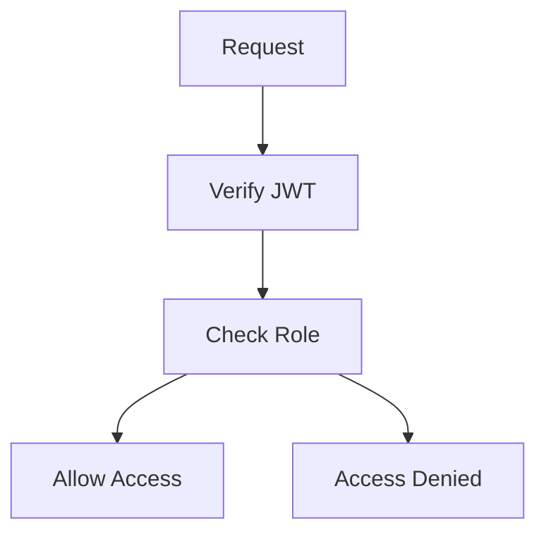
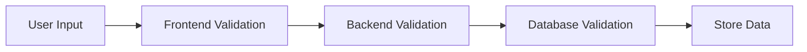
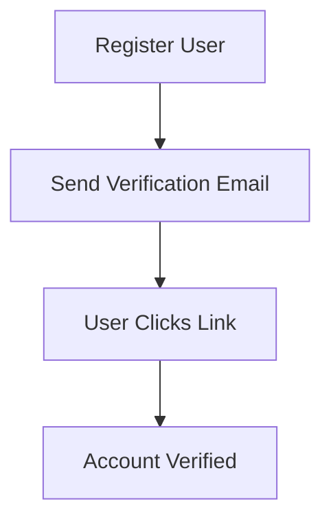
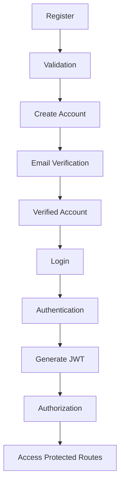

# 🔐 Authentication, Authorization, Validation & Verification

<p align="center">


</p>

---

# 📖 Table of Contents

* [Introduction](#introduction)

* [Authentication](#authentication)

  * [What is Authentication?](#what-is-authentication)
  * [Why Authentication is Needed?](#why-authentication-is-needed)
  * [Authentication Flow](#authentication-flow)
  * [Password Hashing](#password-hashing)

* [What is a Token?](#what-is-a-token)

  * [Why Tokens are Used](#why-tokens-are-used)
  * [JWT (JSON Web Token)](#jwt-json-web-token)
  * [JWT Structure](#jwt-structure)
  * [JWT Authentication Flow](#jwt-authentication-flow)

* [Authorization](#authorization)

  * [What is Authorization?](#what-is-authorization)
  * [Why Authorization is Needed?](#why-authorization-is-needed)
  * [Authorization Flow](#authorization-flow)

* [Authentication vs Authorization](#authentication-vs-authorization)

* [Validation](#validation)

  * [What is Validation?](#what-is-validation)
  * [Types of Validation](#types-of-validation)
  * [Frontend Validation](#frontend-validation)
  * [Backend Validation](#backend-validation)
  * [Database Validation](#database-validation)
  * [Express Validator](#express-validator)

* [Verification](#verification)

  * [What is Verification?](#what-is-verification)
  * [Email Verification Flow](#email-verification-flow)
  * [OTP Verification](#otp-verification)
  * [Phone Verification](#phone-verification)

* [Complete Authentication System Flow](#complete-authentication-system-flow)

* [Real World Example (Instagram)](#real-world-example-instagram)

* [Quick Revision Table](#quick-revision-table)

* [Best Practices](#best-practices)

* [Conclusion](#conclusion)

---

## Quick Navigation

<p align="center">

<a href="#authentication">🔐 Authentication</a> • <a href="#what-is-a-token">🎫 JWT & Tokens</a> • <a href="#authorization">🛡 Authorization</a> • <a href="#validation">✅ Validation</a> • <a href="#verification">📧 Verification</a>

</p>

---

# Introduction

Whenever we build applications such as:

* Instagram
* Facebook
* LinkedIn
* Amazon
* Netflix
* Banking Applications
* E-Commerce Platforms

we must solve some important security problems:

### Question 1

Who is the user?

➡ Authentication

### Question 2

What actions can the user perform?

➡ Authorization

### Question 3

Is the entered information valid?

➡ Validation

### Question 4

Has the user confirmed their identity?

➡ Verification

These concepts work together to create secure applications.

---

# Authentication

## What is Authentication?

Authentication is the process of verifying the identity of a user.

In simple words:

> Authentication answers the question:
>
> **"Who are you?"**

Before allowing access to an application, the server must verify that the user is actually who they claim to be.

---

## Why Authentication is Needed?

Without authentication:

* Anyone can access private data
* Anyone can modify user information
* Anyone can pretend to be another user

Authentication protects applications from unauthorized access.

---

## Real-Life Example

Imagine entering your college.

The security guard asks for your ID card.

You show your ID card.

The guard checks it and confirms your identity.

Only after verification are you allowed to enter.

This is Authentication.

---

## Examples of Authentication

### Email & Password

```text
Email: divyanshu@gmail.com
Password: ********
```

### OTP Login

```text
Enter OTP: 456789
```

### Google Login

```text
Continue with Google
```

### GitHub Login

```text
Continue with GitHub
```

---

## Authentication Flow



---

# Password Hashing

Passwords should never be stored directly in a database.

❌ Bad Practice

```text
123456
admin123
password
```

✅ Good Practice

```text
$2b$10$Fv2Rj3...
```

Hashing converts passwords into unreadable strings.

Common Library:

```bash
npm install bcrypt
```

Benefits:

* Protects user passwords
* Reduces risk during database leaks
* Industry standard security practice

---

# What is a Token?

After successful authentication, the server creates a token.

A token is a digital proof that the user has already logged in.

---

## Real-Life Example

Imagine attending a concert.

1. You show your ticket.
2. Security verifies it.
3. You receive a wristband.

Now you don't need to show your ticket repeatedly.

The wristband acts like a token.

---

## Why Tokens are Used

Without tokens:

* Users would need to log in repeatedly.
* Servers would struggle to identify logged-in users.

Tokens allow applications to recognize authenticated users.

---

# JWT (JSON Web Token)

JWT stands for:

**JSON Web Token**

A JWT is commonly used in modern web applications for authentication and authorization.

---

## JWT Structure

```text
xxxxx.yyyyy.zzzzz
```

A JWT contains three parts.

### Header

```json
{
  "alg":"HS256",
  "typ":"JWT"
}
```

---

### Payload

```json
{
  "id":"123",
  "role":"admin"
}
```

---

### Signature

Used to verify that the token was not modified.

---

## JWT Authentication Flow



---

# Authorization

## What is Authorization?

Authorization determines what actions a user can perform.

In simple words:

> Authorization answers:
>
> **"What are you allowed to do?"**

---

## Why Authorization is Needed?

Different users have different permissions.

Examples:

* User
* Moderator
* Admin

Not everyone should have access to every feature.

---

## Real-Life Example

You entered the office building.

Authentication already happened.

Now:

* Employee → Office Area
* Manager → Management Floor
* Admin → Server Room

Everyone entered successfully.

But permissions are different.

That is Authorization.

---

## Example

### User

```json
{
 "role":"user"
}
```

Allowed:

✅ View Profile

✅ Edit Profile

Not Allowed:

❌ Delete Users

❌ Manage System

---

### Admin

```json
{
 "role":"admin"
}
```

Allowed:

✅ Delete Users

✅ Create Users

✅ Manage System

---

## Authorization Flow



---

# Authentication vs Authorization

| Authentication    | Authorization                |
| ----------------- | ---------------------------- |
| Who are you?      | What can you do?             |
| Verifies identity | Verifies permissions         |
| Login Process     | Permission Process           |
| Happens First     | Happens After Authentication |

---

# Validation

## What is Validation?

Validation checks whether the entered data is correct.

In simple words:

> Validation answers:
>
> **"Is the provided information correct?"**

---

## Why Validation is Important?

Without validation:

```text
Email: abc
Password: 1
Age: -50
```

Invalid data could be stored inside the database.

---

# Types of Validation

## Frontend Validation

Performed before data reaches the server.

Example:

```javascript
if(password.length < 6){
   alert("Password too short");
}
```

Benefits:

* Better user experience
* Faster feedback

---

## Backend Validation

Performed on the server.

Example:

```javascript
if(!email || !password){
 return res.status(400).json({
   message:"All fields required"
 });
}
```

Benefits:

* Prevents malicious requests
* Ensures security

---

## Database Validation

Performed by Mongoose.

```javascript
email:{
 type:String,
 required:true,
 unique:true,
 match:/^[^\s@]+@[^\s@]+\.[^\s@]+$/
}
```

Benefits:

* Final layer of protection
* Prevents invalid records

---

## Validation Flow



---

# Express Validator

Install:

```bash
npm install express-validator
```

Example:

```javascript
const { body, validationResult } = require("express-validator");

app.post(
"/register",

body("email").isEmail(),

body("password").isLength({min:6}),

(req,res)=>{

 const errors = validationResult(req);

 if(!errors.isEmpty()){
   return res.status(400).json({
      errors: errors.array()
   });
 }

 res.send("Valid Data");

});
```

---

# Verification

## What is Verification?

Verification confirms that provided information is real and trusted.

In simple words:

> Verification answers:
>
> **"Can you prove this information is genuine?"**

---

## Why Verification is Needed?

Authentication proves identity.

Verification proves authenticity.

Examples:

* Email Verification
* Phone Verification
* OTP Verification
* Two Factor Authentication

---

# Email Verification Flow



---

## OTP Verification

Example:

```text
OTP: 456789
```

The user must enter the correct OTP sent by the server.

---

## Phone Verification

Example:

```text
Mobile Number Verification
```

The server sends an SMS OTP.

The user enters the OTP.

Phone number becomes verified.

---

# Complete Authentication System Flow



---

# Real World Example (Instagram)

### Registration

User enters:

```text
Email
Username
Password
```

Validation checks:

✅ Email Format

✅ Password Length

---

### Verification

Instagram sends an email verification link.

---

### Authentication

User logs in using credentials.

---

### Token

Instagram generates a JWT.

---

### Authorization

User:

✅ Upload Posts

✅ Like Posts

❌ Delete Other Users

Admin:

✅ Moderate Content

✅ Delete Accounts

---

# Quick Revision Table

| Concept        | Main Question                 |
| -------------- | ----------------------------- |
| Authentication | Who are you?                  |
| Token          | Proof that you are logged in  |
| Authorization  | What can you do?              |
| Validation     | Is the data correct?          |
| Verification   | Is the information confirmed? |

---

# Best Practices

## Authentication

✅ Hash passwords using bcrypt

✅ Use JWT

✅ Use HTTPS

---

## Authorization

✅ Implement role-based access

✅ Protect admin routes

---

## Validation

✅ Validate on frontend

✅ Validate on backend

✅ Validate in database

---

## Verification

✅ Email verification

✅ OTP verification

✅ Two-factor authentication

---

# Conclusion

Authentication, Authorization, Validation, Verification, and Tokens are the core building blocks of modern secure applications.

Think of them like this:

| Concept        | Easy Meaning                |
| -------------- | --------------------------- |
| Authentication | Who are you?                |
| Token          | Your digital identity card  |
| Authorization  | What are you allowed to do? |
| Validation     | Is the data correct?        |
| Verification   | Is the information genuine? |

Mastering these concepts is one of the first and most important steps toward becoming a strong Backend Developer and Full-Stack Engineer.
