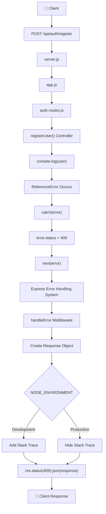

# 🚨 Express Error Handling Flow

This diagram illustrates how Express handles runtime errors using a centralized **Global Error Handling Middleware**.

Instead of sending error responses inside every controller, Express allows us to forward errors to a single middleware using `next(error)`.

---

# 📌 Error Handling Lifecycle



---

# 📖 Step-by-Step Flow

## 1️⃣ Client Sends Request

The client sends an HTTP request.

```http
POST /api/auth/register
```

⬇️

---

## 2️⃣ `server.js`

The Express server starts listening for incoming requests.

Every request first enters:

```text
server.js
```

which loads the Express application from `app.js`.

⬇️

---

## 3️⃣ `app.js`

The request enters the Express application.

Here Express registers:

* Application middleware
* Routes
* Global Error Middleware

The request is forwarded to:

```text
/api/auth
```

⬇️

---

## 4️⃣ `auth.routes.js`

The request matches:

```javascript
POST /api/auth/register
```

Express executes:

```text
registerUser()
```

⬇️

---

## 5️⃣ `registerUser()` Controller

This is where the business logic is executed.

Example:

```javascript
console.log(user);
```

Since `user` was never declared,

JavaScript immediately throws:

```text
ReferenceError:
user is not defined
```

Execution immediately stops.

⬇️

---

## 6️⃣ `catch(error)`

The error is caught inside the `catch` block.

```javascript
catch(error) {
    ...
}
```

At this point,

we have access to the complete Error Object.

Example:

```javascript
error.message
error.stack
```

⬇️

---

## 7️⃣ Attach HTTP Status Code

Before forwarding the error,

we attach our own status code.

```javascript
error.status = 409;
```

Why?

Because JavaScript errors don't automatically know which HTTP status code should be returned.

Example:

* 400 → Bad Request
* 401 → Unauthorized
* 404 → Not Found
* 409 → Conflict
* 500 → Internal Server Error

⬇️

---

## 8️⃣ `next(error)`

This is the most important part of Express Error Handling.

```javascript
next(error);
```

Instead of sending the response here,

we pass the error to Express.

When Express receives:

```javascript
next(error)
```

it automatically:

* Skips all remaining routes and middleware.
* Looks for the Global Error Handling Middleware.
* Forwards the error to that middleware.

⬇️

---

## 9️⃣ Express Error Handling System

Internally,

Express detects that an error was passed to `next()`.

It searches for middleware having **four parameters**:

```javascript
(err, req, res, next)
```

That middleware is treated as an **Error Handling Middleware**.

⬇️

---

## 🔟 `handleError` Middleware

Now Express executes:

```javascript
handleError(err, req, res, next)
```

This middleware receives the exact same Error Object.

Example:

```javascript
err.message
err.status
err.stack
```

⬇️

---

## 1️⃣1️⃣ Create Response Object

A response object is created.

```javascript
const response = {
    message: err.message
};
```

Initially,

only the error message is added.

⬇️

---

## 1️⃣2️⃣ Development vs Production

During development,

it's useful to know exactly where the error occurred.

So we include:

```javascript
response.stack = err.stack;
```

Example:

```text
ReferenceError:
user is not defined

at auth.controller.js:10
```

### Development

```json
{
    "message": "user is not defined",
    "stack": "ReferenceError..."
}
```

---

### Production

For security reasons,

stack traces should never be exposed.

Only the message is returned.

```json
{
    "message": "user is not defined"
}
```

⬇️

---

## 1️⃣3️⃣ Send Final Response

Finally,

Express sends:

```javascript
res.status(err.status).json(response);
```

Example:

```http
409 Conflict
```

```json
{
    "message": "user is not defined"
}
```

The request lifecycle ends here.

---

# 🔄 Complete Error Flow

```text
Client
   │
   ▼
POST /api/auth/register
   │
   ▼
server.js
   │
   ▼
app.js
   │
   ▼
auth.routes.js
   │
   ▼
registerUser()
   │
   ▼
Business Logic
   │
   ▼
Runtime Error
   │
   ▼
catch(error)
   │
   ▼
error.status = 409
   │
   ▼
next(error)
   │
   ▼
Express Error Handling System
   │
   ▼
handleError(err, req, res, next)
   │
   ▼
Create Response Object
   │
   ▼
Development?
   │
 ┌─┴─────────────┐
 │               │
Yes             No
 │               │
 ▼               ▼
Add Stack     Hide Stack
 │               │
 └───────┬───────┘
         ▼
res.status(err.status).json(response)
         │
         ▼
Client Response
```

---

# 💡 Key Takeaways

* `try...catch` captures runtime errors inside controllers.
* `error.status` allows us to attach an HTTP status code to the error.
* `next(error)` tells Express to stop normal execution and invoke the Global Error Middleware.
* Express automatically searches for middleware with the signature `(err, req, res, next)`.
* A centralized error middleware ensures consistent error responses across the application.
* Stack traces should only be included during development.
* Clients always receive a structured JSON response instead of the server crashing.

### ✅ Benefits of Global Error Handling

* Centralized error management
* Cleaner controller code
* Consistent API responses
* Easier debugging during development
* Improved security in production by hiding internal implementation details
