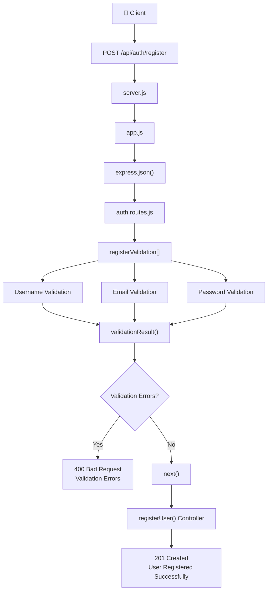

# 🚀 Express Validator Request Flow

This diagram illustrates how a request travels through the application, from the client to the final response.

---

## 📌 Request Lifecycle



---

## 📖 Step-by-Step Flow

### 1️⃣ Client Sends Request

The client sends a request to register a new user.

```http
POST /api/auth/register
```

---

### 2️⃣ `server.js`

* Starts the Express server.
* Imports the Express application from `app.js`.
* Listens for incoming HTTP requests.

⬇️

---

### 3️⃣ `app.js`

The request enters the Express application.

The `express.json()` middleware:

* Parses incoming JSON data.
* Converts the request body into a JavaScript object.
* Makes the data available through `req.body`.

Example:

```json
{
  "username": "Divyanshu",
  "email": "divyanshu@gmail.com",
  "password": "Password123"
}
```

⬇️

---

### 4️⃣ `auth.routes.js`

The request matches:

```javascript
POST /api/auth/register
```

Express executes middleware in the following order:

```text
registerValidation[]
↓

registerUser()
```

---

### 5️⃣ `registerValidation[]`

This is an array of middleware.

Each validator runs one after another.

```text
Username Validation
        ↓
Email Validation
        ↓
Password Validation
        ↓
validationResult()
```

---

### 6️⃣ Individual Validators

#### Username Validation

Checks whether:

* `username` exists
* `username` is a string

---

#### Email Validation

Checks whether:

* Email follows a valid email format

Example:

```
abc@gmail.com ✅

abcgmail.com ❌
```

---

#### Password Validation

Checks whether:

* Password has at least **6 characters**
* Contains at least **one uppercase letter**
* Contains at least **one number**

Example:

```
password123 ❌

Password123 ✅
```

---

### 7️⃣ `validationResult(req)`

After all validations finish,

Express Validator collects every validation error.

```text
validationResult(req)
```

Then it checks:

```text
Are there any validation errors?
```

---

## ❌ Validation Failed

If one or more validations fail:

* Controller is **not executed**
* Express immediately returns:

```http
400 Bad Request
```

Example Response:

```json
{
  "errors": [
    {
      "msg": "Email should be a valid email address"
    }
  ]
}
```

---

## ✅ Validation Passed

If no validation errors exist:

```javascript
next()
```

is called.

`next()` tells Express:

> "Everything is valid. Continue to the next middleware."

---

### 8️⃣ `registerUser()` Controller

Since validation succeeded,

Express now executes the controller.

Here your business logic begins.

Example:

* Save user to database
* Hash password
* Generate JWT
* Send success response

---

### 9️⃣ Success Response

Finally, Express sends:

```http
201 Created
```

```json
{
  "message": "User registered successfully"
}
```

---

# 🔄 Complete Request Flow

```text
Client
   │
   ▼
POST /api/auth/register
   │
   ▼
server.js
   │
   ▼
app.js
   │
   ▼
express.json()
   │
   ▼
auth.routes.js
   │
   ▼
registerValidation[]
   │
   ├── Username Validation
   ├── Email Validation
   └── Password Validation
           │
           ▼
validationResult(req)
           │
     ┌─────┴─────┐
     │           │
 Validation   Validation
   Failed      Passed
     │           │
     ▼           ▼
400 Error     next()
                  │
                  ▼
          registerUser()
                  │
                  ▼
      201 Created Response
```

---

## 💡 Key Takeaways

* `express.json()` parses incoming JSON data.
* `registerValidation[]` is a middleware chain.
* Each validator checks a specific field.
* `validationResult(req)` collects all validation errors.
* If validation fails, Express returns a **400 Bad Request** response.
* If validation passes, `next()` transfers control to the controller.
* The controller executes only after all validations succeed.
* The final response is returned to the client.
