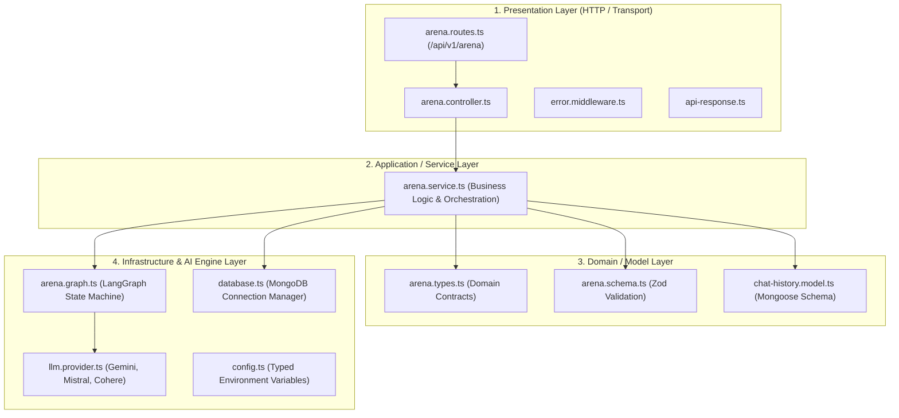
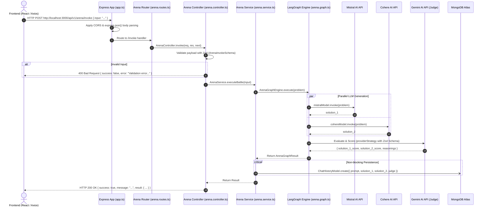
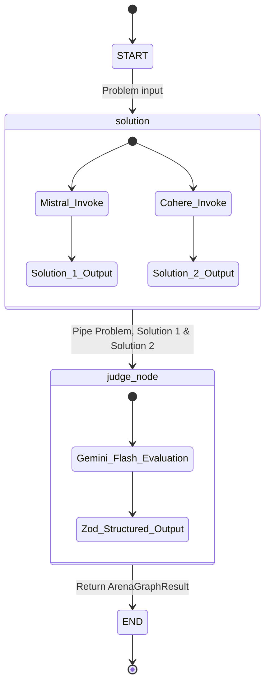

<div align="center">

# ⚙️ DualMind AI Arena — Backend Architecture & API
### *High-Throughput 4-Layer Clean Architecture with LangGraph Orchestration & MongoDB Persistence*

[](https://github.com/DibyanshuChauhan)
[](https://www.typescriptlang.org/)
[](https://nodejs.org/)
[](https://expressjs.com/)
[](https://www.mongodb.com/)
[](https://langchain-ai.github.io/langgraphjs/)
[](https://zod.dev/)

<p align="center">
  The <b>DualMind AI Arena Backend</b> is an enterprise-grade RESTful API built on Express.js and TypeScript. It implements a strict <b>4-Layer Architecture</b>, orchestrates parallel multi-LLM generation via <b>LangGraph</b>, enforces structured JSON arbitration through <b>Google Gemini</b>, and provides non-blocking MongoDB persistence.
</p>

</div>

---

## 🏛️ 4-Layer Clean Architecture Breakdown

The backend is built around a Clean 4-Layer Architecture to guarantee separation of concerns, strict type safety, testability, and enterprise scalability:



---

## 🔗 How Backend Connects to Frontend (The Exact Execution Flow)



---

## 🧩 Detailed Module Explanations

### 1. Presentation Layer (`src/arena/controllers/` & `src/arena/routes/`)
- **`arena.routes.ts`**: Defines REST endpoints mounted under `/api/v1/arena`:
  - `POST /invoke`: Triggers dual-model comparison and arbitration.
  - `GET /history`: Fetches past battles sorted by `createdAt: -1`.
  - `GET /history/:id`: Fetches a specific battle by ID.
  - `DELETE /history/:id`: Removes a specific battle.
  - `GET /health`: Healthcheck endpoint for monitoring uptime.
- **`arena.controller.ts`**: Extracts request payloads, runs Zod schema validation, dispatches execution to `ArenaService`, and formats responses with `ApiResponse.success`.
- **`error.middleware.ts`**: Global Express error handler that catches `AppError` instances and unknown runtime errors, returning sanitized error responses.

### 2. Service / Application Layer (`src/arena/services/`)
- **`arena.service.ts`**: The central orchestrator:
  - Invokes `ArenaGraphEngine.execute(prompt)`.
  - Asynchronously saves the battle document to MongoDB (`ChatHistoryModel.create()`).
  - Implements complete CRUD methods for chat history.

### 3. Domain / Model Layer (`src/arena/types/`, `src/arena/schemas/`, `src/arena/models/`)
- **`arena.types.ts`**: TypeScript contracts defining `JudgeEvaluation`, `ArenaGraphResult`, and `ChatHistoryItem`.
- **`arena.schema.ts`**: Zod validation schemas ensuring input strings are non-empty and within bounds (1–4000 characters).
- **`chat-history.model.ts`**: Mongoose Schema and Model with reverse-chronological indexing on `createdAt`.

### 4. Infrastructure & AI Engine Layer (`src/infrastructure/`)
- **`llm.provider.ts`**: Singleton factory maintaining long-lived client instances of `ChatMistralAI`, `ChatCohere`, and `ChatGoogle`.
- **`arena.graph.ts`**: Compiles the LangGraph `StateGraph` state machine.
- **`database.ts`**: Resilient Mongoose connection manager with reconnection listeners.

---

## 🤖 LangGraph State Machine Architecture



---

## 🛠️ Step-by-Step Installation & Setup

### 1. Prerequisites
- Node.js `v18.0.0` or higher
- MongoDB (local or MongoDB Atlas connection string)
- API Keys:
  - Google AI Studio: [https://aistudio.google.com/](https://aistudio.google.com/)
  - Mistral AI: [https://console.mistral.ai/](https://console.mistral.ai/)
  - Cohere: [https://dashboard.cohere.com/](https://dashboard.cohere.com/)

### 2. Install Dependencies
```bash
npm install
```

### 3. Configure Environment Variables
Create a `.env` file in `Backend/`:
```env
# AI Model API Keys
GOOGLE_API_KEY=your_gemini_api_key
MISTRALAI_API_KEY=your_mistral_api_key
COHERE_API_KEY=your_cohere_api_key

# MongoDB Connection URI
MONGO_URI=mongodb+srv://<username>:<password>@cluster0.mongodb.net/ai-battle-arena?retryWrites=true&w=majority

# Server Port
PORT=3000
```

### 4. Start Server
```bash
# Start in development mode with hot-reloading
npm run dev

# Run TypeScript typecheck
npx tsc --noEmit
```

---

## 📡 REST API Reference

Base URL: `http://localhost:3000/api/v1`

### 1. Execute Battle & Arbitration
```http
POST /api/v1/arena/invoke
Content-Type: application/json

{
  "input": "Explain the difference between TCP and UDP with code examples"
}
```

#### Response (`200 OK`):
```json
{
  "success": true,
  "message": "Graph executed successfully",
  "result": {
    "solution_1": "### TCP vs UDP\nTCP is connection-oriented...",
    "solution_2": "### Transport Protocols\nTCP provides guaranteed delivery...",
    "judge": {
      "solution_1_score": 9,
      "solution_2_score": 8,
      "solution_1_reasoning": "Solution 1 provided clear socket code examples and header overhead breakdown.",
      "solution_2_reasoning": "Solution 2 was accurate but had fewer practical implementations."
    }
  }
}
```

---

### 2. Fetch Chat History
```http
GET /api/v1/arena/history
```

#### Response (`200 OK`):
```json
{
  "success": true,
  "message": "Chat history retrieved successfully",
  "result": [
    {
      "_id": "66b3f8901234abcd5678ef90",
      "prompt": "Explain the difference between TCP and UDP with code examples",
      "solution_1": "...",
      "solution_2": "...",
      "judge": {
        "solution_1_score": 9,
        "solution_2_score": 8,
        "solution_1_reasoning": "...",
        "solution_2_reasoning": "..."
      },
      "createdAt": "2026-08-07T17:40:00.000Z"
    }
  ]
}
```

---

## 👨‍💻 Author

<div align="center">

### **Divyanshu Chauhan**
[](https://github.com/DibyanshuChauhan)

</div>
