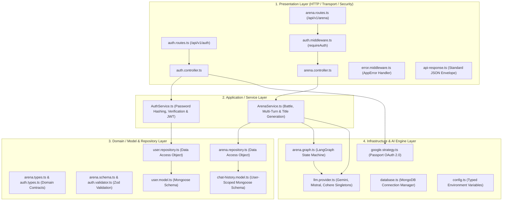
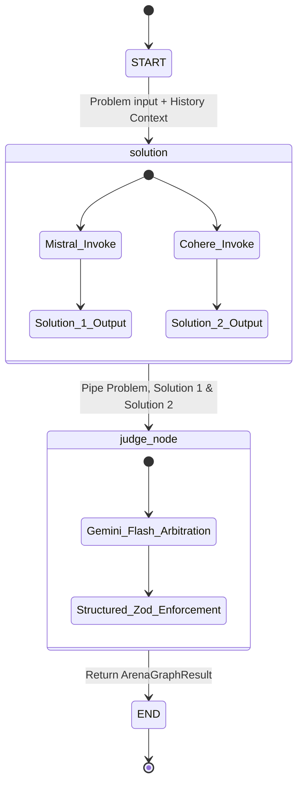

<div align="center">

# ⚙️ DualMind AI Arena - Backend Architecture & API
### *High-Throughput 4-Layer Clean Architecture with Multi-Tenant LangGraph Orchestration & MongoDB Persistence*

[](https://github.com/DibyanshuChauhan)
[](https://www.typescriptlang.org/)
[](https://nodejs.org/)
[](https://expressjs.com/)
[](https://www.mongodb.com/)
[](https://langchain-ai.github.io/langgraphjs/)
[](https://www.passportjs.org/)
[](https://jwt.io/)
[](https://zod.dev/)

<p align="center">
  The <b>DualMind AI Arena Backend</b> is an enterprise-grade RESTful API built on <b>Express 5.x</b> and <b>TypeScript</b>. It implements a strict <b>4-Layer Clean Architecture</b>, orchestrates parallel multi-LLM generation via <b>LangGraph</b>, enforces structured JSON arbitration through <b>Google Gemini</b>, provides non-blocking <b>MongoDB persistence</b>, and features full <b>User Account Isolation</b> with JWT and Google OAuth 2.0.
</p>

</div>

---

## 🏛️ 4-Layer Clean Architecture Breakdown

The backend enforces strict separation of concerns, testability, and enterprise maintainability across 4 decoupled layers:



---

## 🔐 Authentication & Multi-Tenancy Architecture

DualMind protects all arena endpoints behind a hardened authentication layer with strict tenant isolation:

```mermaid
sequenceDiagram
    autonumber
    actor Client as Frontend Client
    participant AuthRouter as /api/v1/auth
    participant AuthCtrl as AuthController
    participant AuthSvc as AuthService
    participant UserDB as MongoDB (Users)
    participant ArenaRouter as /api/v1/arena/*
    participant AuthMW as requireAuth Middleware
    participant ArenaDB as MongoDB (ChatHistory)

    rect rgb(20, 24, 40)
        note over Client,UserDB: Registration / Login Flow
        Client->>AuthRouter: POST /login { email, password }
        AuthRouter->>AuthCtrl: Validate with LoginSchema (Zod)
        AuthCtrl->>AuthSvc: AuthService.login(email, password)
        AuthSvc->>UserDB: Find user by lowercase email
        AuthSvc->>AuthSvc: Verify bcrypt password hash
        AuthSvc->>AuthSvc: Mint signed JWT token
        AuthCtrl-->>Client: Set HTTP-Only Cookie ('token') + 200 OK
    end

    rect rgb(25, 35, 25)
        note over Client,ArenaDB: Authenticated Arena Operations
        Client->>ArenaRouter: POST /invoke { input, sessionId } + Cookie
        ArenaRouter->>AuthMW: requireAuth()
        AuthMW->>AuthMW: Extract & verify JWT from req.cookies.token
        AuthMW->>AuthMW: Attach req.jwtUser = { userId, email, displayName }
        AuthMW->>ArenaRouter: next()
        ArenaRouter->>ArenaDB: Query/Save scoped strictly to { userId: req.jwtUser.userId }
    end
```



### Key Security Features:
1. **HTTP-Only, SameSite=Lax Cookies**: Tokens cannot be intercepted by malicious client-side XSS scripts.
2. **bcrypt Password Hashing**: Passwords are salted and hashed before persistence and automatically stripped from JSON serialization.
3. **Google OAuth 2.0 Integration**: Authenticate instantly using enterprise Google SSO accounts via Passport.js.
4. **User-Scoped Isolation**: All chat history documents in MongoDB require a valid `userId` reference and are indexed with `{ userId: 1, updatedAt: -1 }`.

---

## 🤖 LangGraph State Machine Architecture

The AI orchestration is managed by `@langchain/langgraph` compiling a deterministic `StateGraph`:



### Node Details:
- **`solutionNode`**: Concurrently triggers `Mistral AI` (`mistral-medium-latest`) and `Cohere AI` (`command-a-03-2025`) using `Promise.all`. If prior turns exist, full conversational context is formatted and prepended.
- **`judgeNode`**: Invokes `Google Gemini Flash` using `createAgent` with `providerStrategy` and a Zod schema enforcing scores (`0–10`) and exhaustive reasoning for each model.

---

## 🗄️ MongoDB Database Design

### 1. `User` Schema (`src/auth/models/user.model.ts`)
```typescript
{
  email: { type: String, required: true, unique: true, lowercase: true, index: true },
  displayName: { type: String, required: true, trim: true },
  provider: { type: String, enum: ["local", "google"], default: "local" },
  passwordHash: { type: String, default: null },
  googleId: { type: String, default: null, sparse: true, index: true },
  avatar: { type: String, default: null },
  createdAt: Date,
  updatedAt: Date
}
```

### 2. `ChatHistory` Schema (`src/arena/models/chat-history.model.ts`)
```typescript
{
  userId: { type: Schema.Types.ObjectId, ref: "User", required: true, index: true },
  prompt: { type: String, required: true, trim: true }, // Auto-generated concise title
  solution_1: { type: String, required: true },
  solution_2: { type: String, required: true },
  judge: {
    solution_1_score: Number,
    solution_2_score: Number,
    solution_1_reasoning: String,
    solution_2_reasoning: String
  },
  entries: [
    {
      prompt: String,
      solution_1: String,
      solution_2: String,
      judge: JudgeSchema,
      createdAt: Date,
      updatedAt: Date
    }
  ],
  createdAt: Date,
  updatedAt: Date
}
```

> [!TIP]
> Compound indexes `{ userId: 1, updatedAt: -1 }` and `{ userId: 1, createdAt: -1 }` ensure instantaneous chat history queries even as the database scales.

---

## 🛠️ Step-by-Step Installation & Setup

### 1. Prerequisites
- **Node.js**: `v18.0.0` or higher
- **MongoDB**: Local MongoDB instance or MongoDB Atlas connection string
- **API Keys**:
  - Google Gemini: [Google AI Studio](https://aistudio.google.com/)
  - Mistral AI: [Mistral Console](https://console.mistral.ai/)
  - Cohere: [Cohere Dashboard](https://dashboard.cohere.com/)
  - Google OAuth *(optional)*: [Google Cloud Console](https://console.cloud.google.com/)

---

### 2. Install Dependencies
```bash
cd Backend
npm install
```

---

### 3. Configure Environment Variables
Create a `.env` file in `Backend/`:
```env
# AI Model API Keys
GOOGLE_API_KEY=your_gemini_api_key
MISTRALAI_API_KEY=your_mistral_api_key
COHERE_API_KEY=your_cohere_api_key

# MongoDB Connection URI
MONGO_URI=mongodb+srv://<username>:<password>@cluster0.mongodb.net/ai-battle-arena?retryWrites=true&w=majority

# Server & Session Configuration
PORT=3000
JWT_SECRET=your_jwt_secret_min_32_characters
JWT_EXPIRES_IN=7d
SESSION_SECRET=your_express_session_secret

# Google OAuth 2.0 Credentials (Optional)
GOOGLE_CLIENT_ID=your_google_client_id
GOOGLE_CLIENT_SECRET=your_google_client_secret
GOOGLE_CALLBACK_URL=https://job-ready-ai-cohort-daily-progress-2.onrender.com/auth/google/callback

# Client Origin
FRONTEND_URL=https://job-ready-ai-cohort-daily-progress.vercel.app
```

---

### 4. Run Server
```bash
# Start server in development mode with hot-reloading (tsx watch)
npm run dev

# Run TypeScript type check
npx tsc --noEmit
```

---

## 📡 REST API Reference

Base URL: `http://localhost:3000/api/v1`

### 1. Register Account
```http
POST /api/v1/auth/register
Content-Type: application/json

{
  "email": "developer@example.com",
  "displayName": "Alex Developer",
  "password": "Password123"
}
```
#### Response (`201 Created`):
```json
{
  "success": true,
  "message": "Account created successfully",
  "result": {
    "user": {
      "id": "66b3f8901234abcd5678ef01",
      "email": "developer@example.com",
      "displayName": "Alex Developer",
      "provider": "local"
    }
  }
}
```

---

### 2. User Login
```http
POST /api/v1/auth/login
Content-Type: application/json

{
  "email": "developer@example.com",
  "password": "Password123"
}
```
#### Response (`200 OK`):
*Sets `Set-Cookie: token=...; HttpOnly; SameSite=Lax`*
```json
{
  "success": true,
  "message": "Logged in successfully",
  "result": {
    "user": {
      "id": "66b3f8901234abcd5678ef01",
      "email": "developer@example.com",
      "displayName": "Alex Developer"
    }
  }
}
```

---

### 3. Get Current User (`Me`)
```http
GET /api/v1/auth/me
Cookie: token=...
```
#### Response (`200 OK`):
```json
{
  "success": true,
  "message": "User fetched successfully",
  "result": {
    "user": {
      "userId": "66b3f8901234abcd5678ef01",
      "email": "developer@example.com",
      "displayName": "Alex Developer"
    }
  }
}
```

---

### 4. Execute Arena Battle (Multi-Turn Supported)
```http
POST /api/v1/arena/invoke
Content-Type: application/json
Cookie: token=...

{
  "input": "Explain the difference between TCP and UDP with code examples",
  "sessionId": null
}
```
#### Response (`200 OK`):
```json
{
  "success": true,
  "message": "Graph executed successfully",
  "result": {
    "solution_1": "### TCP vs UDP\nTCP is connection-oriented...",
    "solution_2": "### Transport Protocols\nTCP provides guaranteed delivery...",
    "judge": {
      "solution_1_score": 9,
      "solution_2_score": 8,
      "solution_1_reasoning": "Solution 1 provided clear socket code examples and header overhead breakdown.",
      "solution_2_reasoning": "Solution 2 was accurate but had fewer practical implementations."
    },
    "sessionId": "66b3f8901234abcd5678ef90",
    "entries": [
      {
        "prompt": "Explain the difference between TCP and UDP with code examples",
        "solution_1": "...",
        "solution_2": "...",
        "judge": { ... }
      }
    ]
  }
}
```

---

### 5. Fetch Scoped Chat History
```http
GET /api/v1/arena/history
Cookie: token=...
```
#### Response (`200 OK`):
```json
{
  "success": true,
  "message": "Chat history retrieved successfully",
  "result": [
    {
      "_id": "66b3f8901234abcd5678ef90",
      "prompt": "TCP vs UDP Comparison",
      "solution_1": "...",
      "solution_2": "...",
      "judge": { ... },
      "entries": [ ... ],
      "createdAt": "2026-08-09T10:00:00.000Z",
      "updatedAt": "2026-08-09T10:05:00.000Z"
    }
  ]
}
```

---

### 6. Delete Scoped History Item
```http
DELETE /api/v1/arena/history/:id
Cookie: token=...
```
#### Response (`200 OK`):
```json
{
  "success": true,
  "message": "History item deleted successfully",
  "result": {
    "deleted": true
  }
}
```

---

## 👨‍💻 Author

<div align="center">

### **Divyanshu Chauhan**
*Full Stack AI Engineer & Software Developer*

[](https://github.com/DibyanshuChauhan)
[](https://www.linkedin.com/in/dibyanshuchauhan/)

</div>
