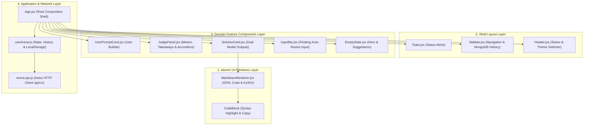
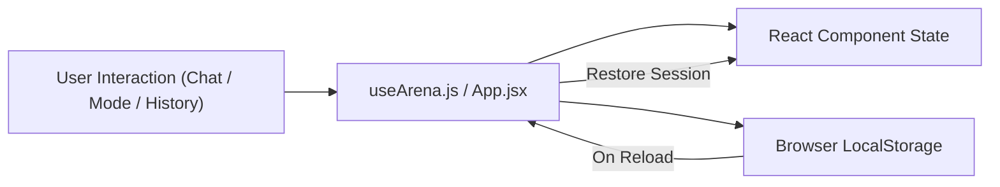

<div align="center">

# 🎨 DualMind AI Arena — Frontend Web Application
### *High-Performance React 18 & Vite Interface with Feature-First Architecture & LaTeX Math Rendering*

[](https://github.com/DibyanshuChauhan)
[](https://reactjs.org/)
[](https://vitejs.dev/)
[](https://developer.mozilla.org/en-US/docs/Web/CSS)
[](https://katex.org/)
[](https://lucide.dev/)

<p align="center">
  The <b>DualMind Frontend</b> delivers a responsive, sleek, and intuitive SaaS experience for comparing dual AI model outputs side-by-side. Built with <b>React 18</b>, <b>Vite</b>, and a custom <b>Glassmorphism Dark Void</b> design system.
</p>

</div>

---

## 🏛️ Frontend Layered & Feature-First Architecture

The frontend is structured into 4 decoupled modular layers:



---

## 🌐 How Frontend Connects to the Internet & Backend

The frontend communicates with the backend through a dedicated, isolated Axios client ([arena.api.js](file:///c:/Users/DELL/Desktop/Job-Ready-AI-Cohort-Daily-Progress/Projects/4.%20AI%20Battle%20Arena/Frontend/src/features/arena/api/arena.api.js)):

```javascript
const apiClient = axios.create({
  baseURL: 'http://localhost:3000/api/v1',
  withCredentials: true,
  timeout: 60000,
  headers: {
    'Content-Type': 'application/json',
  },
});
```

### Endpoints Consumed:
1. `POST /arena/invoke`: Sends `{ input: prompt }`, receives `{ solution_1, solution_2, judge }`.
2. `GET /arena/history`: Fetches past comparison documents saved in MongoDB.
3. `GET /arena/history/:id`: Re-fetches a specific battle record.
4. `DELETE /arena/history/:id`: Deletes a record from MongoDB.
5. `GET /arena/health`: Healthcheck probe.

---

## 💎 Design System & Aesthetic Tokens

The frontend uses a custom **Dark Void SaaS Design System**:

| Token / Variable | Hex Value | Application |
| :--- | :--- | :--- |
| **`--color-base`** | `#08090D` | Deep void app background |
| **`--color-card`** | `#12141D` | Elevated glass card background |
| **`--color-sidebar`** | `#0C0D14` | Left navigation drawer background |
| **`--color-primary`** | `#6366F1` | Vibrant Indigo accent (Model 1) |
| **`--color-violet`** | `#7C3AED` | Deep Violet accent (Model 2) |
| **`--color-emerald`** | `#10B981` | Emerald accent for Winner ribbons |
| **`--color-amber`** | `#F59E0B` | Amber accent for AI Judge decisions |
| **`Typography`** | *Plus Jakarta Sans*, *Inter*, *JetBrains Mono* | Modern typography for headings, body text, and code |

---

## 🧩 Component Breakdown & Capabilities

### 1. `InputBar.jsx`
- **Floating Glass Bar**: Positioned at the bottom with border focus glows.
- **Auto-Resizing Textarea**: Expands dynamically up to `160px` as the user types long queries.
- **Keyboard Shortcuts**:
  - `Enter`: Submits prompt.
  - `Shift + Enter`: Inserts new line.

### 2. `SolutionCard.jsx`
- **Dual Solution Cards**: Displays solutions from **Mistral Medium** and **Cohere Command** side-by-side.
- **Metadata**: Word count calculation and estimated read time (`Math.ceil(words / 200)`).
- **One-Click Copy**: Copies full markdown text to clipboard with instant feedback.
- **Accordion Toggle**: Expands to full height or collapses for easy scanning.
- **Skeleton Shimmering**: Smooth loading placeholders while waiting for AI generation.

### 3. `JudgePanel.jsx`
- **Autonomous Verdict**: Displays the winner badge and score summary.
- **Animated Progress Meters**: Smoothly transitions score bars on a 0–10 scale.
- **Key Takeaways**: Bullet points highlighting why the winning solution outperformed.
- **Expandable Accordions**: In-depth explanations for both solutions.

### 4. `Sidebar.jsx` (Interactive Chat History)
- **MongoDB Sync**: Lists all past comparisons in chronological order with relative timestamps (`Just now`, `5m ago`, `2d ago`).
- **Instant Restore**: Click any history item to reopen the prompt, dual solutions, and judge metrics into the main view.
- **Quick Deletion**: Hover over any chat item to delete it from both the UI and database.
- **"New Arena Chat"**: Resets to the hero view for a clean prompt.

### 5. `MarkdownRenderer.jsx` (Math & Code Engine)
- **LaTeX Math Support**: Converts LaTeX math delimiters (`\(...\)` $\rightarrow$ `$..$` and `\[...\]` $\rightarrow$ `$$..$$`) and renders beautiful mathematical equations via **KaTeX**.
- **GFM Tables & Quotes**: Auto-formats markdown tables and stylized blockquotes.
- **Syntax Highlighting**: Preformatted code containers with language tags and copy buttons.

---

## 💾 Client State & LocalStorage Persistence



| LocalStorage Key | Type | Description |
| :--- | :--- | :--- |
| **`dualmind_arena_entries`** | `JSON Array` | Persists current prompt, dual responses, and judge scores across page refreshes |
| **`dualmind_arena_active_id`** | `String` | Persists the ID of the actively selected chat history item |
| **`dualmind_theme`** | `'dark' \| 'light'` | Persists the user's Dark / Light daylight mode preference |

---

## 🛠️ Step-by-Step Installation & Scripts

### 1. Install Dependencies
```bash
npm install
```

### 2. Start Vite Development Server
```bash
npm run dev
```
*Application opens on `http://localhost:5173`.*

### 3. Production Build
```bash
npm run build
```
*Compiles the optimized production bundle into `dist/`.*

### 4. Preview Production Bundle
```bash
npm run preview
```

---

## 👨‍💻 Author

<div align="center">

### **Divyanshu Chauhan**
[](https://github.com/DibyanshuChauhan)

</div>
