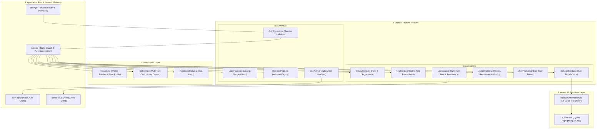
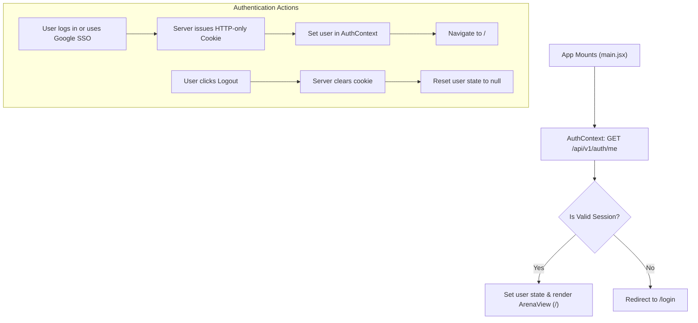
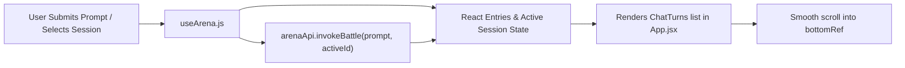

<div align="center">

# 🎨 DualMind AI Arena - Frontend Web Application
### *High-Performance React 19 & Vite 6 Interface with Tailwind CSS v4, Feature-First Architecture & LaTeX Math Engine*

[](https://github.com/DibyanshuChauhan)
[](https://react.dev/)
[](https://vitejs.dev/)
[](https://tailwindcss.com/)
[](https://reactrouter.com/)
[](https://katex.org/)
[](https://lucide.dev/)

<p align="center">
  The <b>DualMind Frontend</b> delivers a responsive, sleek, and intuitive SaaS experience for comparing dual AI model outputs side-by-side. Built with <b>React 19</b>, <b>Vite 6</b>, <b>Tailwind CSS v4</b>, and a custom <b>Dark Void</b> design system with strict authentication route guards and multi-turn state management.
</p>

</div>

---

## 🏛️ Frontend Layered & Feature-First Architecture

The application is engineered into 4 decoupled, reusable layers:



---

## 🔐 Authentication & Protected Route Guards

DualMind features a non-blocking session hydration engine that verifies the user's HTTP-Only cookie on boot:



### Route Table:
| Route | Access Level | Component | Description |
| :--- | :---: | :--- | :--- |
| `/login` | Public / Guest | `LoginPage.jsx` | Email/password signin + Google OAuth redirect |
| `/register` | Public / Guest | `RegisterPage.jsx` | New user account creation with validation |
| `/` | **Protected** | `ArenaView` (`App.jsx`) | Main AI Battle Arena & Multi-Turn workspace |
| `*` | Dynamic | `Navigate` | Fallback route redirecting based on auth status |

---

## 🌌 Dark Void SaaS Design System & CSS Tokens

The user interface follows a modern **Dark Void** aesthetic palette with seamless light/dark mode toggling:

| Token / CSS Variable | Dark Void Hex | Daylight Mode | UI Application |
| :--- | :--- | :--- | :--- |
| **`--color-base`** | `#08090D` | `#F8FAFC` | Main application background |
| **`--color-card`** | `#12141D` | `#FFFFFF` | Elevated glass cards & containers |
| **`--color-sidebar`** | `#0C0D14` | `#F1F5F9` | Left history drawer background |
| **`--color-primary`** | `#6366F1` | `#4F46E5` | Vibrant Indigo accent (Mistral Medium) |
| **`--color-violet`** | `#7C3AED` | `#6D28D9` | Deep Violet accent (Cohere Command) |
| **`--color-emerald`** | `#10B981` | `#059669` | Emerald accent for Winner ribbon badges |
| **`--color-amber`** | `#F59E0B` | `#D97706` | Amber accent for AI Judge decisions |
| **`--font-display`** | *Plus Jakarta Sans* | *Plus Jakarta Sans* | Heading titles and brand typography |
| **`--font-body`** | *Inter* | *Inter* | Body text and descriptions |
| **`--font-mono`** | *JetBrains Mono* | *JetBrains Mono* | Code blocks and inline telemetry |

---

## 🧩 Feature Component Breakdown

### 1. `SolutionCard.jsx` (Dual Model Outputs)
- **Side-by-Side Comparison**: Renders Mistral Medium and Cohere Command outputs concurrently.
- **Dynamic Winner Ribbons**: Highlights the winning solution with glowing emerald badges.
- **Content Telemetry**: Displays word counts and estimated read time (`Math.ceil(words / 200)`).
- **Interactive Collapsing**: Toggle full expansion or collapse for quick scanning.
- **One-Click Clipboard Copy**: Copies markdown content with real-time feedback.
- **Smooth Skeleton Shimmer**: Animated loading placeholders during AI inference.

### 2. `JudgePanel.jsx` (Autonomous AI Verdict)
- **Verdict Summary**: Summarizes the arbitrator's decision and score breakdown.
- **Animated Progress Meters**: Smoothly transitions score progress bars on a 0–10 scale.
- **Detailed Accordions**: Expandable sections detailing specific reasoning for both models.

### 3. `InputBar.jsx` (Floating Dynamic Input)
- **Auto-Resizing Textarea**: Dynamically expands up to `160px` as prompt length grows.
- **Keyboard Shortcuts**:
  - `Enter`: Submits prompt to the battle engine.
  - `Shift + Enter`: Inserts a new line.
- **Interactive Loading States**: Spinner animations and disabled states while generation is in flight.

### 4. `Sidebar.jsx` (Scoped Multi-Turn History)
- **MongoDB Synchronization**: Chronologically lists all past conversation sessions.
- **AI Generated Titles**: Concise 3–6 word titles generated by Gemini for easy identification.
- **Session Switching**: Click any thread to immediately restore all conversation turns.
- **Thread Deletion**: Quick hover-to-delete action that cleans up both client state and database.
- **User Profile & Logout**: Displays logged-in user email, avatar, and 1-click logout button.

### 5. `MarkdownRenderer.jsx` (KaTeX & Code Engine)
- **LaTeX Math Support**: Converts LaTeX syntax (`\(...\)` $\to$ `$...$` and `\[...\]` $\to$ `$$...$$`) and renders equations via **KaTeX**.
- **Syntax Highlighting**: Preformatted code containers with language tags and copy buttons.
- **GFM Formatting**: Stylized markdown tables, task lists, and blockquotes.

---

## 💾 Client State & Multi-Turn Synchronization



---

## 🛠️ Step-by-Step Installation & Scripts

### 1. Install Dependencies
```bash
cd Frontend
npm install
```

---

### 2. Start Vite Development Server
```bash
npm run dev
```
> Application launches on `http://localhost:5173`

---

### 3. Build for Production
```bash
npm run build
```
> Compiles the optimized production assets into `dist/`

---

### 4. Preview Production Bundle
```bash
npm run preview
```

---

## 👨‍💻 Author

<div align="center">

### **Divyanshu Chauhan**
*Full Stack AI Engineer & Software Developer*

[](https://github.com/DibyanshuChauhan)
[](https://www.linkedin.com/in/dibyanshuchauhan/)

</div>
