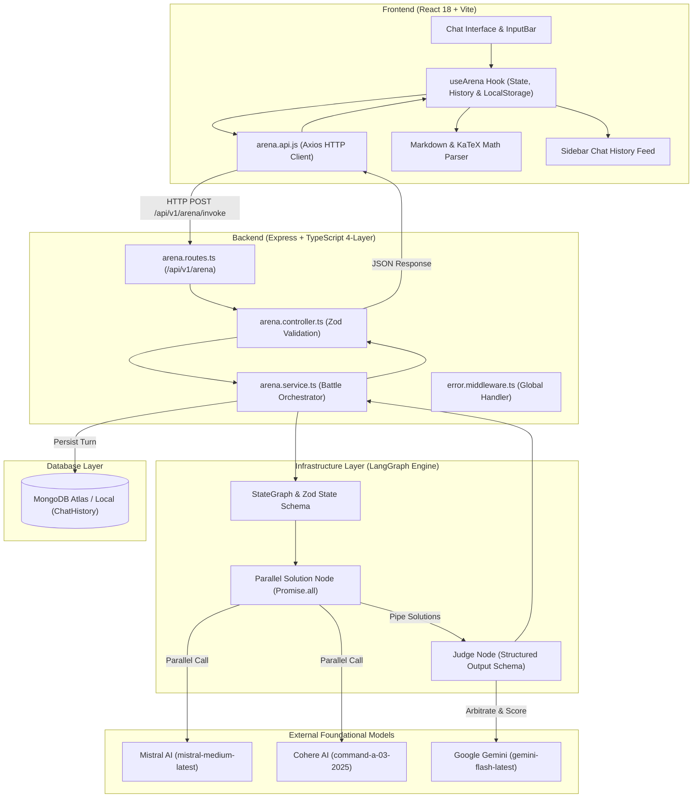

<div align="center">

# ⚡ DualMind AI Battle Arena
### *Enterprise Dual-Model Parallel Generation & Autonomous AI Arbitration Engine*

[](https://github.com/DibyanshuChauhan)
[](https://www.typescriptlang.org/)
[](https://reactjs.org/)
[](https://nodejs.org/)
[](https://expressjs.com/)
[](https://www.mongodb.com/)
[](https://langchain-ai.github.io/langgraphjs/)
[](https://vitejs.dev/)
[](LICENSE)

<br/>

<p align="center">
  <b>DualMind AI Battle Arena</b> is a modern full-stack AI evaluation platform. It dispatches complex user prompts concurrently across competing state-of-the-art foundational models (<b>Mistral Medium</b> vs. <b>Cohere Command</b>) in parallel, and leverages an autonomous <b>Google Gemini Flash</b> judge to rigorously score, evaluate, and arbitrate the superior solution with structured metrics, reasoning, and mathematical rendering.
</p>

[Use Cases](#-real-world-use-cases) • [Architecture](#-system-architecture) • [End-to-End Workflow](#-end-to-end-data-flow) • [Quickstart Guide](#-quickstart--installation) • [API v1 Reference](#-api-v1-specification) • [Author](#-author)

---

</div>

## 🎯 Real-World Use Cases

DualMind AI Battle Arena solves the critical challenge of **LLM blind spots, hallucination detection, and model benchmarking**:

1. **Enterprise LLM Selection & Benchmarking**:
   - Compare how different model architectures (Mistral's open-weights efficiency vs. Cohere's enterprise reasoning) tackle domain-specific coding, legal reasoning, or system architecture tasks.
2. **Automated AI Code Review & Solution Arbitration**:
   - Evaluate algorithmic solutions, time complexity analysis, and mathematical proofs with an impartial arbitrator scoring correctness on a 0–10 scale.
3. **Prompt Engineering Experimentation**:
   - Test prompt robustness and output variance simultaneously without writing manual evaluation scripts or switching between multiple chat tabs.
4. **Interactive Educational Sandbox**:
   - Reopen past comparison sessions from MongoDB history, inspect judge feedback, and learn the strengths and weaknesses of leading language models.

---

## 🏛️ System Architecture



---

## 🔄 End-to-End Data Flow

```mermaid
sequenceDiagram
    autonumber
    actor User as User (Browser)
    participant UI as InputBar.jsx
    participant Hook as useArena.js
    participant API as arena.api.js
    participant Controller as ArenaController.ts
    participant Service as ArenaService.ts
    participant Graph as LangGraph Engine
    participant Mistral as Mistral AI
    participant Cohere as Cohere AI
    participant Gemini as Gemini AI (Judge)
    participant DB as MongoDB Atlas

    User->>UI: Types query & presses Enter ↵
    UI->>Hook: submitPrompt(query)
    Hook->>Hook: Optimistically appends loading skeleton & syncs localStorage
    Hook->>API: arenaApi.invokeBattle(prompt)
    API->>Controller: POST /api/v1/arena/invoke { input }
    Controller->>Controller: Validates input with Zod (ArenaInvokeSchema)
    Controller->>Service: ArenaService.executeBattle(input)
    Service->>Graph: ArenaGraphEngine.execute(problem)
    
    rect rgb(20, 24, 40)
        note over Graph,Cohere: Stage 1: Dual Parallel Model Invocation
        par Execute Mistral
            Graph->>Mistral: mistralModel.invoke(problem)
            Mistral-->>Graph: solution_1 (Markdown text)
        and Execute Cohere
            Graph->>Cohere: cohereModel.invoke(problem)
            Cohere-->>Graph: solution_2 (Markdown text)
        end
    end

    rect rgb(35, 30, 20)
        note over Graph,Gemini: Stage 2: Autonomous AI Arbitration
        Graph->>Gemini: Forward Problem + Solution 1 + Solution 2
        Gemini-->>Graph: Structured Output (Scores 0-10 & Reasoning)
    end

    Graph-->>Service: Return ArenaGraphResult
    
    rect rgb(20, 35, 25)
        note over Service,DB: Stage 3: Asynchronous Database Persistence
        Service-)DB: ChatHistoryModel.create({ prompt, solution_1, solution_2, judge })
    end

    Service-->>Controller: Return Result
    Controller-->>API: 200 OK { success: true, result }
    API-->>Hook: Resolve Promise
    Hook->>Hook: Update state & persist to localStorage
    Hook->>UI: Render Side-by-Side Cards, Metrics & Judge Decision
```



---

## 📂 Project Structure

```
AI Battle Arena/
├── Backend/                       # Express.js + TypeScript 4-Layer Architecture
│   ├── src/
│   │   ├── app.ts                 # Express setup, CORS, body parser & v1 routing
│   │   ├── server.ts              # Server bootstrap & MongoDB connection
│   │   ├── config/                # Environment configuration & typing
│   │   ├── common/                # Shared cross-cutting utilities & middleware
│   │   │   ├── errors/            # AppError class with HTTP status codes
│   │   │   ├── middlewares/       # Global production error handler
│   │   │   └── utils/             # Standardized ApiResponse envelope
│   │   ├── infrastructure/        # External adapters & LangGraph state machine
│   │   │   ├── ai/                # LLMProvider factory & LangGraph Engine
│   │   │   └── db/                # Mongoose Database connection manager
│   │   └── arena/                 # Feature-First Arena Domain Module
│   │       ├── controllers/       # HTTP Request Handlers
│   │       ├── routes/            # Route declarations (/invoke, /history, /health)
│   │       ├── services/          # Battle orchestration & history CRUD logic
│   │       ├── models/            # Mongoose ChatHistory Schema & Model
│   │       ├── schemas/           # Zod Request Validation Schemas
│   │       ├── types/             # Domain TypeScript Interfaces
│   │       └── index.ts           # Module barrel export
│   ├── package.json
│   ├── tsconfig.json
│   └── README.md                  # Backend Technical Documentation
│
├── Frontend/                      # React 18 + Vite + Modern CSS Design System
│   ├── src/
│   │   ├── main.jsx               # React DOM entry point
│   │   ├── app/
│   │   │   ├── App.jsx            # Root application layout & state wiring
│   │   │   └── App.css            # Dark Void design system, glassmorphism tokens
│   │   ├── components/
│   │   │   ├── layout/            # Shell layout components (Header, Sidebar, Toast)
│   │   │   └── ui/                # UI primitives (MarkdownRenderer with KaTeX math)
│   │   └── features/
│   │       └── arena/             # Feature-First Arena Module
│   │           ├── api/           # Axios HTTP client for v1 arena endpoints
│   │           ├── hooks/         # useArena hook (state, history & localStorage)
│   │           └── components/    # Feature UI (EmptyState, InputBar, SolutionCard, JudgePanel, UserPromptCard)
│   ├── package.json
│   ├── vite.config.js
│   └── README.md                  # Frontend Technical Documentation
│
└── README.md                      # Master Workspace Documentation
```

---

## ⚡ Quickstart & Installation

### 1. Prerequisites
- **Node.js**: `v18.0.0` or higher
- **MongoDB**: Local MongoDB community server or MongoDB Atlas cluster URI
- **API Keys**:
  - Google Gemini API key ([Google AI Studio](https://aistudio.google.com/))
  - Mistral AI API key ([Mistral Console](https://console.mistral.ai/))
  - Cohere API key ([Cohere Dashboard](https://dashboard.cohere.com/))

---

### 2. Clone the Repository
```bash
git clone https://github.com/DibyanshuChauhan/Job-Ready-AI-Cohort-Daily-Progress.git
cd "Job-Ready-AI-Cohort-Daily-Progress/Projects/4. AI Battle Arena"
```

---

### 3. Backend Setup
```bash
cd Backend

# 1. Install dependencies
npm install

# 2. Configure environment variables
# Create a .env file in the Backend directory:
```

Populate `Backend/.env`:
```env
# AI Model API Keys
GOOGLE_API_KEY=your_gemini_api_key_here
MISTRALAI_API_KEY=your_mistral_api_key_here
COHERE_API_KEY=your_cohere_api_key_here

# MongoDB Connection URI
MONGO_URI=mongodb+srv://<username>:<password>@cluster0.mongodb.net/ai-battle-arena?retryWrites=true&w=majority

# Server Port
PORT=3000
```

Start the backend:
```bash
npm run dev
```
> Server runs on `http://localhost:3000`

---

### 4. Frontend Setup
In a new terminal:
```bash
cd Frontend

# 1. Install dependencies
npm install

# 2. Start Vite development server
npm run dev
```
> Application opens on `http://localhost:5173`

---

## 📡 API v1 Specification

Base URL: `http://localhost:3000/api/v1`

| Method | Endpoint | Description |
| :--- | :--- | :--- |
| `POST` | `/arena/invoke` | Executes parallel battle (Mistral + Cohere) and AI Judge arbitration |
| `GET` | `/arena/history` | Retrieves list of all past comparison sessions from MongoDB |
| `GET` | `/arena/history/:id` | Retrieves a specific comparison session by ID |
| `DELETE` | `/arena/history/:id` | Deletes a specific history record |
| `DELETE` | `/arena/history` | Clears all history records |
| `GET` | `/arena/health` | Service health status check |

---

## 👨‍💻 Author

<div align="center">

### **Divyanshu Chauhan**
*Full Stack AI Engineer & Software Developer*

[](https://github.com/DibyanshuChauhan)
[](https://www.linkedin.com/in/dibyanshuchauhan/)

*Crafted with precision for the Job-Ready AI Cohort.*

</div>
