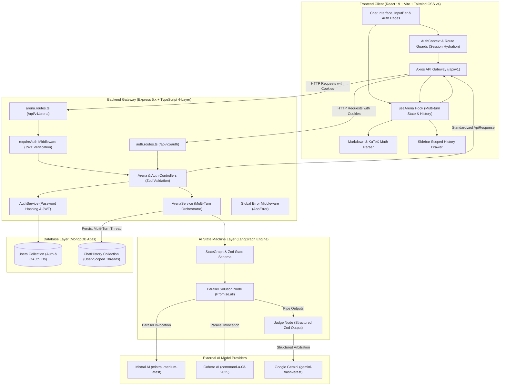
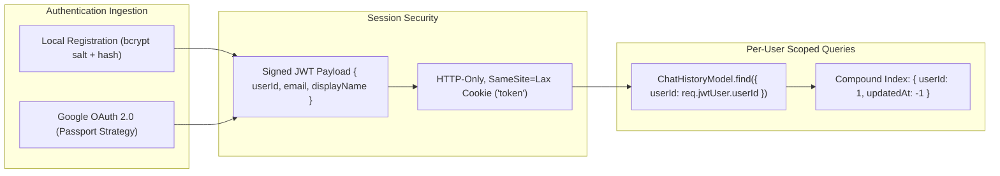

<div align="center">

# ⚡ DualMind AI Battle Arena
### *Enterprise Dual-Model Parallel Generation, Multi-Turn Orchestration & Autonomous AI Arbitration Engine*

[](https://github.com/DibyanshuChauhan)
[](https://www.typescriptlang.org/)
[](https://react.dev/)
[](https://vitejs.dev/)
[](https://nodejs.org/)
[](https://expressjs.com/)
[](https://www.mongodb.com/)
[](https://langchain-ai.github.io/langgraphjs/)
[](https://tailwindcss.com/)
[](LICENSE)

<br/>

<p align="center">
  <b>DualMind AI Battle Arena</b> is a modern, multi-tenant AI benchmarking and evaluation platform. It dispatches complex user prompts concurrently across competing foundational models (<b>Mistral Medium</b> vs. <b>Cohere Command</b>) in parallel, maintains <b>stateful multi-turn conversation threads</b>, enforces <b>strict user account isolation</b> with Google OAuth 2.0 & JWT, and leverages an autonomous <b>Google Gemini Flash</b> judge to rigorously score, evaluate, and arbitrate the superior solution with structured metrics, deep reasoning, and LaTeX mathematical rendering.
</p>

<p align="center">
  🌐 <b>Live Frontend (Vercel):</b> <a href="https://job-ready-ai-cohort-daily-progress.vercel.app/login" target="_blank">job-ready-ai-cohort-daily-progress.vercel.app</a><br/>
  🚀 <b>Live Backend API (Render):</b> <a href="https://job-ready-ai-cohort-daily-progress-2.onrender.com" target="_blank">job-ready-ai-cohort-daily-progress-2.onrender.com</a>
</p>

[Key Capabilities](#-key-capabilities) • [System Architecture](#-system-architecture) • [End-to-End Workflow](#-end-to-end-data-flow) • [Authentication & Security](#-authentication--tenant-isolation) • [Quickstart Guide](#-quickstart--installation) • [API v1 Reference](#-api-v1-specification) • [Author](#-author)

---

</div>

## 🌟 Key Capabilities

<table>
  <tr>
    <td width="50%">
      <h3>⚔️ Dual Parallel LLM Execution</h3>
      <p>Dispatches incoming user prompts simultaneously across <b>Mistral Medium</b> and <b>Cohere Command</b> via LangGraph state graphs with zero-latency overhead and robust timeout handling.</p>
    </td>
    <td width="50%">
      <h3>⚖️ Autonomous AI Arbitration</h3>
      <p><b>Google Gemini Flash</b> evaluates both generated responses on a strict 0–10 scoring scale, providing transparent winner ribbons, breakdown metrics, and structured critique.</p>
    </td>
  </tr>
  <tr>
    <td width="50%">
      <h3>🔒 Enterprise User Account Isolation</h3>
      <p>Complete authentication suite with <b>Email/Password (bcrypt)</b> and <b>Google OAuth 2.0 SSO</b>. Chat histories and multi-turn sessions are strictly scoped per user in MongoDB.</p>
    </td>
    <td width="50%">
      <h3>💬 Multi-Turn Stateful Conversations</h3>
      <p>Interactive follow-up inquiries maintain full conversational context across turns. Powered by automatic AI chat title generation and instant sidebar session switching.</p>
    </td>
  </tr>
  <tr>
    <td width="50%">
      <h3>📐 LaTeX Math & GFM Code Engine</h3>
      <p>Full support for scientific, algorithmic, and mathematical prompts with <b>KaTeX</b> equation rendering, syntax-highlighted code containers, and 1-click clipboard copy.</p>
    </td>
    <td width="50%">
      <h3>🌌 Dark Void SaaS Design System</h3>
      <p>Built with React 19 and Tailwind CSS v4 featuring glassmorphism cards, animated score meters, smooth skeleton shimmering, and daylight/dark mode toggling.</p>
    </td>
  </tr>
</table>

---

## 🏛️ System Architecture



---

## 🔄 End-to-End Data Flow

```mermaid
sequenceDiagram
    autonumber
    actor User as User (Browser)
    participant Client as React App (useArena / Axios)
    participant Auth as Auth Middleware (requireAuth)
    participant Controller as ArenaController.ts
    participant Service as ArenaService.ts
    participant Graph as LangGraph Engine
    participant Mistral as Mistral AI
    participant Cohere as Cohere AI
    participant Gemini as Gemini AI (Judge)
    participant DB as MongoDB Atlas

    User->>Client: Enters prompt & clicks Submit ↵
    Client->>Client: Appends optimistic turn & starts skeleton shimmer
    Client->>Auth: POST /api/v1/arena/invoke { input, sessionId? } + Cookie
    Auth->>Auth: Verify JWT cookie & attach req.jwtUser.userId
    alt Missing / Invalid Token
        Auth-->>Client: 401 Unauthorized
    end
    Auth->>Controller: Forward authenticated request
    Controller->>Controller: Validate payload with Zod (ArenaInvokeSchema)
    Controller->>Service: ArenaService.executeBattle(input, sessionId, userId)
    
    Service->>DB: Fetch previous turns for context if sessionId provided
    DB-->>Service: Return conversation history
    Service->>Graph: ArenaGraphEngine.execute(prompt, historyContext)

    rect rgb(20, 24, 40)
        note over Graph,Cohere: Stage 1: Dual Parallel Model Invocation
        par Execute Mistral Medium
            Graph->>Mistral: mistralModel.invoke(prompt + history)
            Mistral-->>Graph: solution_1 (Markdown text)
        and Execute Cohere Command
            Graph->>Cohere: cohereModel.invoke(prompt + history)
            Cohere-->>Graph: solution_2 (Markdown text)
        end
    end

    rect rgb(35, 30, 20)
        note over Graph,Gemini: Stage 2: Autonomous AI Arbitration
        Graph->>Gemini: Forward Prompt + Solution 1 + Solution 2
        Gemini-->>Graph: Structured JSON (Scores 0-10, Winner, Detailed Reasonings)
    end

    Graph-->>Service: Return ArenaGraphResult
    
    rect rgb(20, 35, 25)
        note over Service,DB: Stage 3: User-Scoped Multi-Turn Thread Persistence
        Service->>DB: Update/Create ChatHistory { userId, prompt, entries: [...turns] }
    end

    Service-->>Controller: Return { solution_1, solution_2, judge, sessionId, entries }
    Controller-->>Client: 200 OK Standardized ApiResponse
    Client->>Client: Update state, stop shimmers, render cards & score meters
```



---

## 🔒 Authentication & Tenant Isolation

DualMind implements strict multi-tenancy to ensure complete privacy between users:



> [!IMPORTANT]
> All Chat History records in MongoDB are indexed by `userId`. Users can never access, read, or delete conversation history belonging to another account.

---

## 📂 Project Structure

```
AI Battle Arena/
├── Backend/                       # Express 5.x + TypeScript 4-Layer Architecture
│   ├── src/
│   │   ├── app.ts                 # Express configuration, CORS, session & route mounting
│   │   ├── server.ts              # Server bootstrap & MongoDB lifecycle
│   │   ├── config/                # Strongly typed environment configuration
│   │   ├── common/                # Shared utilities, errors & middlewares
│   │   │   ├── errors/            # AppError class with HTTP status codes
│   │   │   ├── middlewares/       # Global error handler & requireAuth middleware
│   │   │   ├── types/             # Authenticated request contracts
│   │   │   └── utils/             # Standardized ApiResponse envelope
│   │   ├── infrastructure/        # External adapters & LangGraph state machine
│   │   │   ├── ai/                # LLMProvider factory & LangGraph Engine
│   │   │   └── db/                # Mongoose connection manager
│   │   ├── auth/                  # Feature-First Auth Module
│   │   │   ├── controllers/       # AuthController (register, login, me, logout)
│   │   │   ├── models/            # UserModel with bcrypt password hashing
│   │   │   ├── repositories/      # User persistence abstraction
│   │   │   ├── routes/            # /api/v1/auth routes & Google OAuth callback
│   │   │   ├── services/          # AuthService (JWT minting & password verification)
│   │   │   ├── strategies/        # Passport Google OAuth 2.0 strategy
│   │   │   └── validators/        # Zod registration & login schemas
│   │   └── arena/                 # Feature-First Arena Domain Module
│   │       ├── controllers/       # ArenaController (invoke, history, clear)
│   │       ├── models/            # ChatHistoryModel with IChatTurn arrays
│   │       ├── repositories/      # User-scoped ChatHistory repository
│   │       ├── routes/            # /api/v1/arena routes
│   │       ├── schemas/           # Zod ArenaInvokeSchema
│   │       ├── services/          # ArenaService (orchestration & AI title generator)
│   │       └── types/             # Domain TypeScript interfaces
│   ├── package.json
│   ├── tsconfig.json
│   └── README.md                  # Backend Technical Documentation
│
├── Frontend/                      # React 19 + Vite 6 + Tailwind CSS v4
│   ├── src/
│   │   ├── main.jsx               # React DOM entry point with Router & AuthProvider
│   │   ├── app/
│   │   │   ├── App.jsx            # Protected Route setup & ArenaView layout
│   │   │   └── App.css            # Dark Void design tokens & glassmorphism utilities
│   │   ├── components/
│   │   │   ├── layout/            # Layout shell (Header, Sidebar, Toast)
│   │   │   └── ui/                # MarkdownRenderer with KaTeX math & CodeBlock
│   │   └── features/
│   │       ├── auth/              # Auth Feature Module
│   │       │   ├── api/           # authApi Axios client
│   │       │   ├── components/    # LoginPage & RegisterPage
│   │       │   ├── context/       # AuthContext & session hydration hook
│   │       │   └── hooks/         # useAuth custom hook
│   │       └── arena/             # Arena Feature Module
│   │           ├── api/           # arenaApi Axios client
│   │           ├── hooks/         # useArena hook (multi-turn turns & history sync)
│   │           └── components/    # SolutionCard, JudgePanel, InputBar, UserPromptCard
│   ├── package.json
│   ├── vite.config.js
│   └── README.md                  # Frontend Technical Documentation
│
└── README.md                      # Master Workspace Documentation
```

---

## ⚡ Quickstart & Installation

### 1. Prerequisites
- **Node.js**: `v18.0.0` or higher
- **MongoDB**: Local MongoDB instance or [MongoDB Atlas](https://www.mongodb.com/cloud/atlas) cluster URI
- **API Keys**:
  - Google Gemini API key ([Google AI Studio](https://aistudio.google.com/))
  - Mistral AI API key ([Mistral Console](https://console.mistral.ai/))
  - Cohere API key ([Cohere Dashboard](https://dashboard.cohere.com/))
  - *(Optional)* Google OAuth Credentials ([Google Cloud Console](https://console.cloud.google.com/))

---

### 2. Clone the Repository
```bash
git clone https://github.com/DibyanshuChauhan/Job-Ready-AI-Cohort-Daily-Progress.git
cd "Job-Ready-AI-Cohort-Daily-Progress/Projects/4. AI Battle Arena"
```

---

### 3. Backend Setup
```bash
cd Backend

# 1. Install dependencies
npm install

# 2. Configure environment variables
# Create a .env file in the Backend directory:
```

Populate `Backend/.env`:
```env
# AI Model API Keys
GOOGLE_API_KEY=your_gemini_api_key_here
MISTRALAI_API_KEY=your_mistral_api_key_here
COHERE_API_KEY=your_cohere_api_key_here

# MongoDB Connection URI
MONGO_URI=mongodb+srv://<username>:<password>@cluster0.mongodb.net/ai-battle-arena?retryWrites=true&w=majority

# Server & Session Secrets
PORT=3000
JWT_SECRET=your_super_secret_jwt_key_min_32_characters
JWT_EXPIRES_IN=7d
SESSION_SECRET=your_express_session_secret_key

# Google OAuth 2.0 (Optional for Local Email Auth)
GOOGLE_CLIENT_ID=your_google_client_id
GOOGLE_CLIENT_SECRET=your_google_client_secret
GOOGLE_CALLBACK_URL=http://localhost:3000/auth/google/callback

# Client URL
FRONTEND_URL=http://localhost:5173
```

Start the backend:
```bash
npm run dev
```
> Server runs on `http://localhost:3000`

---

### 4. Frontend Setup
In a new terminal:
```bash
cd Frontend

# 1. Install dependencies
npm install

# 2. Start Vite development server
npm run dev
```
> Application opens on `http://localhost:5173`

---

## 📡 API v1 Specification

Base URL: `http://localhost:3000/api/v1`

### Authentication Endpoints
| Method | Endpoint | Auth Required | Description |
| :--- | :--- | :---: | :--- |
| `POST` | `/auth/register` | No | Creates a new user account with hashed password |
| `POST` | `/auth/login` | No | Authenticates credentials and sets HTTP-only cookie |
| `GET` | `/auth/me` | Yes | Returns authenticated user profile from token |
| `POST` | `/auth/logout` | No | Clears session cookie |
| `GET` | `/auth/google` | No | Initiates Google OAuth 2.0 authentication flow |
| `GET` | `/auth/google/callback` | No | Handles Google OAuth callback redirect |

### Arena Endpoints
| Method | Endpoint | Auth Required | Description |
| :--- | :--- | :---: | :--- |
| `POST` | `/arena/invoke` | Yes | Executes parallel multi-LLM battle & AI arbitration |
| `GET` | `/arena/history` | Yes | Retrieves user's scoped chat history sessions |
| `GET` | `/arena/history/:id` | Yes | Retrieves a specific conversation thread by ID |
| `DELETE` | `/arena/history/:id` | Yes | Deletes a specific conversation thread |
| `DELETE` | `/arena/history` | Yes | Clears all conversation threads for the current user |
| `GET` | `/arena/health` | No | Service health and uptime check |

---

## 👨‍💻 Author

<div align="center">

### **Divyanshu Chauhan**
*Full Stack AI Engineer & Software Developer*

[](https://github.com/DibyanshuChauhan)
[](https://www.linkedin.com/in/dibyanshuchauhan/)

*Crafted with precision for the Job-Ready AI Cohort.*

</div>
